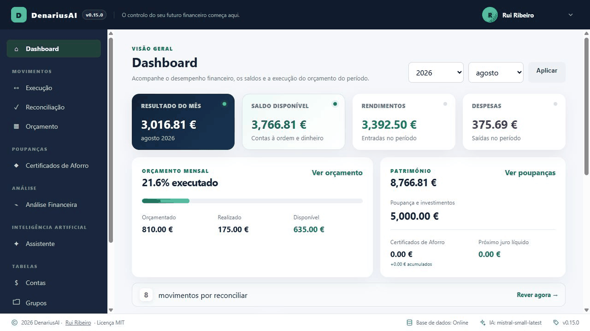

<div align="center">

# DenariusAI

### Personal and family finance, clearly managed.

[](https://dotnet.microsoft.com/)
[](https://learn.microsoft.com/aspnet/core/)
[](https://www.microsoft.com/sql-server/)
[](https://www.docker.com/)
[](https://ollama.com/)
[](LICENSE)
[](https://denarius-ai.westeurope.cloudapp.azure.com)

Developed by [Rui Ribeiro](https://github.com/ruialexrib)

<h3><a href="https://denarius-ai.westeurope.cloudapp.azure.com/" target="_blank" rel="noopener noreferrer">Open the live demonstration</a></h3>

_The demo runs on an Azure virtual machine and may be temporarily unavailable when the VM is switched off._

### Application tour



</div>

---

## About

DenariusAI is a personal and family finance management platform built around double-entry accounting. It combines daily financial management with budgeting, bank reconciliation, savings, investments, insurance, analytics and administrative organisation in one secure and consistent workspace.

AI features assist with transaction entry, classification, financial questions, correspondence analysis and Markdown report generation. The AI layer can use Mistral AI as a cloud provider or Ollama for local inference. Suggestions are always reviewed by the user before relevant data is saved.

## Highlights

- Double-entry financial management with accounts, groups, categories and transactions
- Monthly budgeting and transaction allocation
- AI-assisted bank reconciliation and transaction classification
- Configurable AI provider with cloud inference through Mistral AI or local inference through Ollama
- Dashboards, period comparisons and financial analytics
- Portuguese Savings Certificates portfolio and projections
- Stock portfolio and watchlist with market price history, performance tracking and optional ARIMA forecasts
- Automatic stock market history collection through a configurable market-data provider
- Insurance portfolio with policy details, premium records, renewal dates and status tracking
- Document, correspondence and warranty management
- Reminders and alerts for relevant dates and expirations
- AI-assisted correspondence analysis and metadata extraction
- AI-powered financial assistant and intelligent reports
- Authentication, user roles, administrative auditing and configurable application settings
- Optional read-only MCP financial tools

### Financial management

DenariusAI organises day-to-day finances around accounts, financial groups, categories and double-entry journal entries. Transactions can represent income, expenses and transfers while keeping the accounting structure balanced and providing a consistent basis for balances, statements, reconciliation and reporting.

The same financial model is shared by the application's operational and analytical areas, so information entered once can be reused across budgets, dashboards and financial analysis without delegating deterministic calculations to the AI layer.

### Monthly budgeting

Monthly budgets provide a planning layer over registered financial activity. Amounts can be allocated across the configured financial structure and compared with actual transactions, making it possible to follow planned versus realised values throughout the month.

Budget information remains connected to the underlying financial records, allowing the user to review execution in the same workspace used for transaction management and analysis.

### Bank reconciliation

The reconciliation workflow helps match bank activity with DenariusAI financial records and supports transaction classification. AI assistance can propose classifications and interpretations where configured, while the user remains responsible for reviewing the proposed result before financial data is changed.

This combines automation with explicit user control and keeps reconciliation tied to the application's double-entry accounting model.

### Financial analytics

Dashboards and analytics turn registered financial data into period-based views of income, expenses, balances and financial evolution. Comparisons across periods help identify changes in spending and other relevant trends without requiring a separate reporting system.

Analytical results are calculated from application data, while AI can be used separately to explain or contextualise information when that assistance is enabled.

### Savings Certificates

The Savings Certificates portfolio tracks Portuguese savings-certificate subscriptions as part of the household's broader financial position. Registered holdings can be followed over time with their associated values and projections, keeping this form of savings visible alongside cash accounts and other investments.

This dedicated area separates the characteristics of Savings Certificates from listed securities while still integrating them into the same personal-finance workspace.

### Stock portfolio

The stock portfolio brings listed investments into the same personal-finance workspace. Positions can be registered with ticker, exchange, trading currency, quantity and average purchase price, while the watchlist can also track instruments that are not currently held.

Historical market prices can be collected from the configured provider and are used to show price evolution, period change, minimum and maximum prices, and current unrealised gain or loss. When enabled and enough observations are available, DenariusAI can also calculate deterministic ARIMA-based 30, 60 and 90-day price forecasts with 95% confidence intervals. Forecasts are indicative only and never change financial records automatically.

### Insurance portfolio

The insurance portfolio centralises personal and family policies in DenariusAI. Policies can be registered by type, insurer, policy number and insured object, together with start and renewal dates, payment frequency, status and notes. Premium amounts are maintained as separate records associated with each policy.

The portfolio dashboard provides an overview of active policies and registered insurance costs for the current year, together with outstanding premium information and upcoming renewal dates. This keeps recurring insurance commitments visible alongside the rest of the user's financial information.

### Documents, correspondence and warranties

DenariusAI also provides administrative areas for information that belongs around personal and family finances but is not itself an accounting transaction. Documents, correspondence and warranties can be maintained in the application so relevant records and dates remain accessible from the same workspace.

Correspondence can use configured AI assistance for analysis and metadata extraction, helping interpret incoming information while leaving stored records and their final classification under user control.

### Reminders and alerts

Relevant dates and expirations can be surfaced through reminders and alerts. This provides a common way to keep time-sensitive financial and administrative commitments visible rather than relying only on the individual area where each record was created.

The reminder layer complements areas such as documents and warranties by drawing attention to dates that may require action.

### AI assistant and reports

The optional financial assistant provides a natural-language interface for questions about the user's DenariusAI data. AI is also used in selected workflows for interpretation, classification assistance and Markdown report generation.

The AI provider is configurable in the application settings. Mistral AI remains the default provider and uses its remote API, while Ollama can be selected to run a compatible model through a local or privately hosted Ollama server. With Ollama running inside the installation's trusted infrastructure, prompts and financial context sent to the model do not need to be processed by a third-party cloud AI provider.

The AI layer is deliberately advisory: deterministic financial calculations remain application responsibilities, and suggestions that would affect financial records remain subject to user review.

### Administration and security

DenariusAI includes authentication, user and role management, administrative auditing and configurable application settings. These capabilities support controlled access to personal-finance information and provide administrators with the tools required to manage an installation without mixing administration with normal financial workflows.

Optional Google authentication can be enabled for existing users while local authentication remains available. Google sign-in does not automatically provision new DenariusAI users.

### MCP integration

An optional Model Context Protocol (MCP) surface exposes read-only financial tools for compatible external AI clients and integrations. This allows selected DenariusAI information to be queried through a structured interface without giving the MCP layer permission to modify financial records.

The read-only design preserves the application's principle that financial changes remain controlled by DenariusAI workflows and the user.

## Technology

| Technology | Role |
| --- | --- |
| **.NET 9 / ASP.NET Core MVC** | Web application and business workflows |
| **Entity Framework Core** | Persistence and database migrations |
| **SQL Server 2022** | Financial and identity data |
| **Mistral AI** | Optional cloud AI provider for natural-language assistance and reports |
| **Ollama** | Optional local or privately hosted AI inference |
| **Docker Compose** | Reproducible local deployment |
| **xUnit** | Unit, integration and MCP tests |

## Quick start

Requirements: Docker Engine or Docker Desktop with Docker Compose.

```powershell
git clone https://github.com/ruialexrib/denarius-ai.git
cd denarius-ai
Copy-Item .env.example .env
```

Set secure local passwords in `.env`. If you intend to use the default Mistral AI provider, also add `MISTRAL_API_KEY`. Ollama does not require a Mistral API key. Then start the application:

```powershell
docker compose up --build -d
docker compose ps
```

Open [http://localhost:8080](http://localhost:8080).

```powershell
docker compose logs -f denarius-ai-web
docker compose down
```

Never commit `.env`, credentials or real financial data.

### AI providers

DenariusAI supports two AI providers. **Mistral AI** is the installation default and requires a `MISTRAL_API_KEY` for remote inference. **Ollama** can instead be selected in the application's administrative settings and does not require a Mistral API key.

For local AI, install [Ollama](https://ollama.com/), download a suitable model and make the Ollama server reachable from the DenariusAI web application. The built-in defaults are:

```text
AI.Provider = Ollama
Ollama.Model = llama3.2
Ollama.BaseUrl = http://localhost:11434
```

These are application settings rather than required `.env` variables and can be changed by an administrator. `Ollama.BaseUrl` may point to a local or remote HTTP/HTTPS Ollama endpoint. When DenariusAI itself runs in Docker, remember that `localhost` inside the web container refers to that container; configure an address that the container can use to reach the Ollama service.

The selected provider is used by the configurable AI service for the application's assisted workflows. Regardless of provider, AI output remains advisory: DenariusAI performs deterministic financial calculations itself and the user confirms changes to financial records.

### Stock market data

Stock price history, portfolio updates and watchlist market data use the Alpha Vantage service. Create a free API key at [Alpha Vantage](https://www.alphavantage.co/support/#api-key) and add it to your `.env` file:

```text
MARKET_DATA_API_KEY=your_api_key
```

The API key is required only for stock market data features. Keep it private and never commit it to the repository.

### Optional Google authentication

User provisioning remains exclusive to DenariusAI administrators. Google authentication never creates a local account: access is granted only when the Google email exactly matches an existing application user. The same user can continue to sign in with the local email and password.

Create OAuth 2.0 web credentials in Google Cloud and register this authorized redirect URI for a local installation:

```text
http://localhost:8080/signin-google
```

For a public installation, register the equivalent HTTPS address for its domain. Configure the credentials in `.env`:

```text
GOOGLE_CLIENT_ID=
GOOGLE_CLIENT_SECRET=
```

When either value is absent, the Google button is not displayed and local authentication continues to work normally.

## License

Distributed under the [MIT License](LICENSE). Copyright © 2026 [Rui Ribeiro](https://github.com/ruialexrib).
