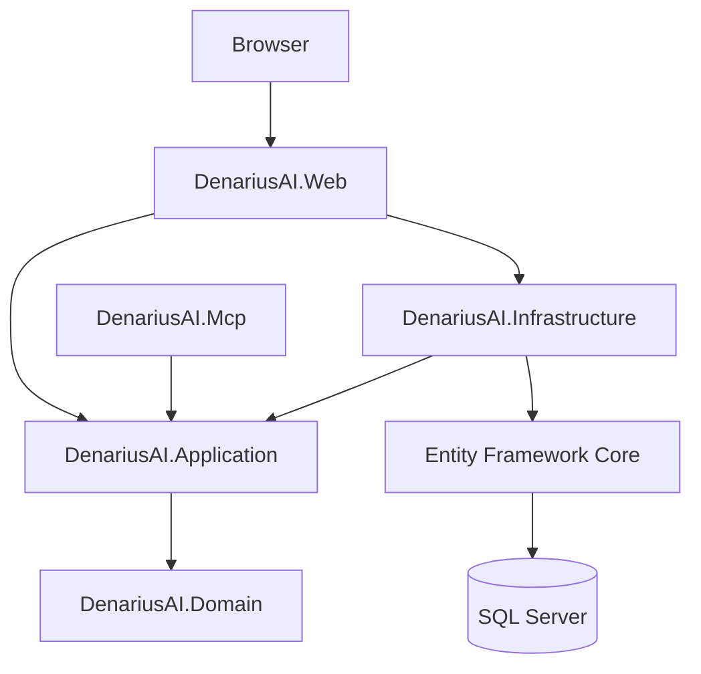

# DenariusAI

**Personal and family finance management platform with double-entry accounting, budgeting, reconciliation, analytics and AI-powered financial insights.**

DenariusAI é uma aplicação web para gestão de finanças pessoais e familiares. O repositório denomina-se `denarius-ai`. A solução está a ser construída incrementalmente em ASP.NET Core MVC, com separação por camadas e persistência em SQL Server.

## Estado

**Fase 14 — Assistente:** chat financeiro autenticado e fundamentado em contexto read-only, usando o modelo `mistral-small-latest`.

O hardening para produção pertence à fase seguinte.

## Arquitectura



### Projectos

| Projecto | Responsabilidade | Dependências internas |
|---|---|---|
| `DenariusAI.Domain` | Modelo e regras fundamentais | Nenhuma |
| `DenariusAI.Application` | Casos de utilização e contratos | Domain |
| `DenariusAI.Infrastructure` | EF Core, Identity e integrações | Application, Domain |
| `DenariusAI.Web` | MVC, Razor e composição | Application, Infrastructure |
| `DenariusAI.Mcp` | Servidor MCP e ferramentas financeiras de leitura | Application, Infrastructure |
| `DenariusAI.UnitTests` | Regras isoladas | Domain, Application |
| `DenariusAI.IntegrationTests` | Persistência e endpoints | Infrastructure, Web |
| `DenariusAI.McpTests` | Contratos das ferramentas MCP | MCP |

Application contém os contratos `IRepository<T>`, `IUnitOfWork` e os serviços financeiros reutilizados futuramente pela interface MVC e pelo MCP. Infrastructure implementa estes contratos com Entity Framework Core; lançamentos completos são gravados dentro de uma transação.

## Stack

- .NET 9 e ASP.NET Core MVC
- Entity Framework Core 9
- ASP.NET Core Identity
- SQL Server 2022
- xUnit
- Docker e Docker Compose

## Requisitos

- .NET SDK 9.0.312 ou uma feature band posterior do .NET 9
- Docker com Docker Compose

## Execução local

Configure `ConnectionStrings:DenariusAIDatabase` com User Secrets ou variável de ambiente e execute:

```powershell
dotnet restore DenariusAI.slnx
dotnet build DenariusAI.slnx --no-restore
dotnet run --project src/DenariusAI.Web
```

O endpoint `/health` confirma também a conectividade do `DenariusDbContext`.

## Docker

Crie a configuração local sem a adicionar ao Git:

```powershell
Copy-Item .env.example .env
```

Substitua a password de exemplo em `.env` e execute:

```powershell
docker compose up --build -d
docker compose ps
```

A aplicação fica disponível em `http://localhost:8080` por omissão. A base de dados não é publicada no host e os dados persistem no volume `denarius-ai-sql-data`.

O primeiro utilizador é criado de forma idempotente a partir de `DENARIUS_AI_ADMIN_EMAIL`, `DENARIUS_AI_ADMIN_PASSWORD` e `DENARIUS_AI_ADMIN_DISPLAY_NAME`. As credenciais devem ser alteradas no ficheiro `.env` local antes do arranque.

## Migrations

O projecto está preparado para migrations EF Core e aplica migrations pendentes durante o arranque. A primeira migration do domínio será criada quando o modelo financeiro for introduzido; `EnsureCreated` não é utilizado.

```powershell
dotnet ef migrations add NomeDaMigration --project src/DenariusAI.Infrastructure --startup-project src/DenariusAI.Web --output-dir Persistence/Migrations
dotnet ef database update --project src/DenariusAI.Infrastructure --startup-project src/DenariusAI.Web
```

## Testes

```powershell
dotnet test DenariusAI.slnx
```

## Servidor MCP

O servidor usa o transporte standard `stdio` e disponibiliza ferramentas de leitura para contas, movimentos, execução orçamental, reconciliação, análise e resumo financeiro. As ferramentas dependem exclusivamente dos serviços de Application; a composição da persistência é feita no arranque do host MCP.

Com a base de dados Docker em execução, compile a imagem e inicie o servidor através de:

```powershell
docker compose --profile mcp build denarius-ai-mcp
docker compose run --rm -T denarius-ai-mcp
```

Num cliente MCP, configure `docker` como comando e os argumentos `compose`, `run`, `--rm`, `-T`, `denarius-ai-mcp`, usando o directório deste repositório como directório de trabalho. Fora de Docker, execute `dotnet run --project src/DenariusAI.Mcp` e forneça `ConnectionStrings__DenariusAIDatabase` no ambiente.

## Configuração da Mistral

A integração usa `ILLMService` e a implementação `MistralLLMService`, através do endpoint oficial de chat completions. O fornecedor pode ser substituído sem alterar os consumidores da camada Application. O modelo configurado por omissão é `mistral-small-latest`.

Configure a chave apenas por User Secrets ou ambiente:

```powershell
dotnet user-secrets set "Mistral:ApiKey" "SUA_CHAVE" --project src/DenariusAI.Web
```

Em Docker, preencha `MISTRAL_API_KEY` no ficheiro `.env` local. A página Definições apresenta o estado da integração e permite testar a ligação. A chave nunca é apresentada, registada nos logs ou guardada na base de dados.

## Assistente financeiro

O menu **Assistente** disponibiliza uma conversa com os dados financeiros. Cada pergunta é acompanhada por contexto estruturado produzido pelos serviços read-only usados pelas ferramentas MCP: contas, movimentos recentes, orçamento corrente, reconciliação, dashboard e análise anual. O modelo é instruído a não inventar valores e a indicar quando os dados são insuficientes. O histórico mantido no browser é limitado e não é persistido na base de dados.

No formulário **Novo movimento**, a opção **Preencher com IA** permite descrever uma operação em linguagem natural. O modelo pede esclarecimentos enquanto faltarem dados e só depois sugere o preenchimento de campos e partidas equilibradas. A sugestão é validada contra as contas, categorias e orçamentos ativos; nunca é gravada automaticamente.

## Definições e preferências

**Preferências**, no menu do utilizador, contém apenas dados pessoais. **Definições**, na navegação de configuração, contém parâmetros globais e constitui a fronteira preparada para futura autorização exclusiva de administradores. Modelo, endpoint, temperatura, tokens, limites de contexto e os prompts do Assistente e da sugestão de movimentos são persistidos na base de dados e aplicados nas chamadas seguintes sem reiniciar. Segredos, incluindo `MISTRAL_API_KEY`, permanecem exclusivamente no ambiente.

## Roadmap

1. Fundação
2. Autenticação e layout
3. Domínio financeiro
4. Repositories e services
5. Grupos e categorias
6. Contas
7. Movimentos por partidas dobradas
8. Reconciliação
9. Orçamento
10. Dashboard
11. Análise
12. MCP
13. Mistral
14. Assistente
15. Hardening
